# Advanced Lane Finding Project

The goals / steps of this project are the following:

* Compute the camera calibration matrix and distortion coefficients given a set of chessboard images.
* Apply a distortion correction to raw images.
* Use color transforms, gradients, etc., to create a thresholded binary image.
* Apply a perspective transform to rectify binary image ("birds-eye view").
* Detect lane pixels and fit to find the lane boundary.
* Determine the curvature of the lane and vehicle position with respect to center.
* Warp the detected lane boundaries back onto the original image.
* Output visual display of the lane boundaries and numerical estimation of lane curvature and vehicle position.

**Here I will consider the [rubric](https://review.udacity.com/#!/rubrics/571/view) points individually and describe how I addressed each point in my implementation**.  

---

# Project Description

## 1. Submission Files

My project includes the following files:

| Files         		                          |     Description	           						      |
|:-----------------------------------------------:|:-----------------------------------------------------:|
|Main.py 				                          |Entry, Configure Video, Read and write frame, GUI      |
|lane.py 				                          |lane finding, pipeline, and draw 		              |
|line.py 				                          |lane lines fit, valid and store		                  |
|preprocess.py			                          |thresholding, preprocessing, parameters, keyhandler	  |
|README.md 		                                  |summarizing the results								  |
|carnd-p4-env.yml 		                          |conda environment 									  |
|video_output           	                      |All project and debug video output                     |
|writeup_res                                      |writeup resource                                       |
|data.pickle                                      |Store parameters, include calibration and thresholding and so on|

## 2. Camera Calibration

I start by preparing "object points", which will be the (x, y, z) coordinates of the chessboard corners in the world. Here I am assuming the chessboard is fixed on the (x, y) plane at z=0, such that the object points are the same for each calibration image.  Thus, `objp` is just a replicated array of coordinates, and `objpoints` will be appended with a copy of it every time I successfully detect all chessboard corners in a test image.  `imgpoints` will be appended with the (x, y) pixel position of each of the corners in the image plane with each successful chessboard detection.  

I then used the output `objpoints` and `imgpoints` to compute the camera calibration and distortion coefficients using the `cv2.calibrateCamera()` function.  I applied this distortion correction to the test image using the `cv2.undistort()` function and obtained this result: 

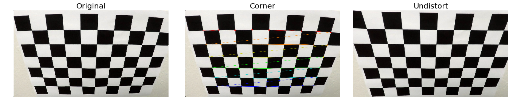

**File**: preprocess.py

**Input**: Chessboard Images captured by Camera in this project, number of inside corners in x, y

**Output**:  camera matrix, distortion coefficients

```python
def calibration(images, nx, ny):
    # prepare object points, like (0,0,0), (1,0,0), (2,0,0) ....,(6,5,0)
    objp = np.zeros((nx*ny,3), np.float32)
    objp[:,:2] = np.mgrid[0:nx,0:ny].T.reshape(-1,2)

    # Arrays to store object points and image points from all the images.
    objpoints = [] # 3d points in real world space
    imgpoints = [] # 2d points in image plane.

    # Step through the list and search for chessboard corners
    for i, fname in enumerate(images):
        img = cv2.imread(fname)
        gray = cv2.cvtColor(img,cv2.COLOR_BGR2GRAY)
        # Find the chessboard corners
        ret, corners = cv2.findChessboardCorners(gray, (nx,ny),None)

        # If found, add object points, image points
        if ret == True:
            objpoints.append(objp)
            imgpoints.append(corners)
            # Draw and display the corners
            img = cv2.drawChessboardCorners(img, (nx,ny), corners, ret)
            cv2.imshow('img',img)
            cv2.waitKey(0)
    ret, mtx, dist, rvecs, tvecs = cv2.calibrateCamera(objpoints, imgpoints, gray.shape[::-1], None, None)
    return mtx, dist
```

## 3. Perspective Transform

> A perspective transform maps the points in a given image to different, desired, image points with a new perspective. The perspective transform you’ll be most interested in is a bird’s-eye view transform that let us view a lane from above.

In this project, I defined three pairs of transform matrixes.

| Matrixes Name| Source | Destination | Purpose|
|:------------:|:---------------:|:--------------------:|:---------------------------:|
|M_max<br>MInv_max| [585, 460]<br>[695, 460]<br>[1127, 720]<br>[203, 720]|[320, 0]<br>[960, 0]<br>[960, 720]<br>[320, 720]| Project and Challenge|
|M_mid<br>MInv_mid| [480, 500]<br>[740, 500]<br>[1110, 720]<br>[200, 720]|[320, 0]<br>[960, 0]<br>[960, 720]<br>[320, 720]| Hard Challenge Most sections|
|M_min<br>MInv_min| [410, 560]<br>[850, 560]<br>[1110, 720]<br>[200, 720]|[320, 0]<br>[960, 0]<br>[960, 720]<br>[320, 720]| Hard Challenge sharp curve|

I notice that the harder challenge video has many sharp curve, it's unsuitable using histogram in these cases, for example NO.3 below. So, I decide to create a smaller transform, then I can get a left and right balanced area, e.g. NO.4, 5. 

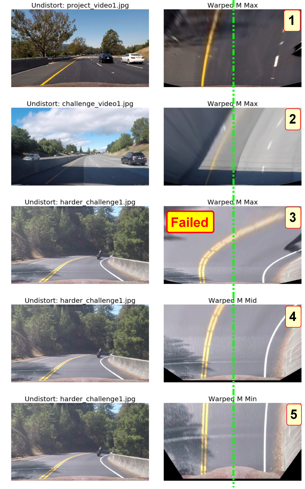

## 3. Pipeline

The figure shows the approximate data flow of the system, the sequence number indicates the order of processing.

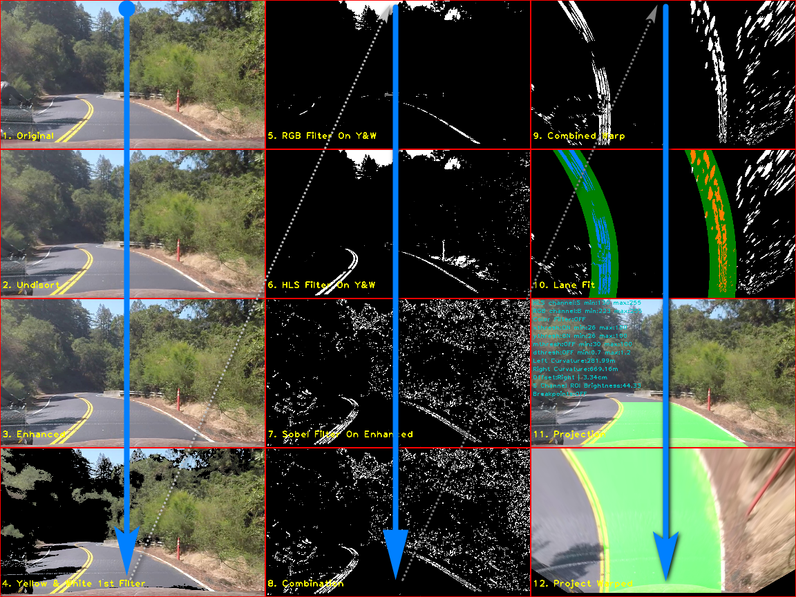

I use different pipelines between hard video and the other two. These are their different parts.

| Parameters       		| Project and Challenge     	    | Hard Challenge                          |
|:---------------------:|:---------------------------------:|:---------------------------------------:|
|Color Filter           |Two layers color filters           |First layer color filter, when meet high brightness,<br> open second layer|
|Sobel Filter           |None                               |X, Y                                     |
|M & MInv               |Max                                |Middle for most part, Min for very sharp section|
|Window Width (margin)  |40                                 |65                                       |

### 3.1. Get Original Image

I use the OpenCV GUI, read a frame from video file one by one

**File**: Main.py

**Input**: Project videos

**Output**: frame

```python
cv2.namedWindow(w_name, cv2.WINDOW_AUTOSIZE)
cap = cv2.VideoCapture(input_file)
ret, frame = cap.read()
```

### 3.2. Undistort Image

These distortions are caused by curved lenses, light rays often bend at the edges of these lenses. 
There are two kinds of [distortion](https://classroom.udacity.com/nanodegrees/nd013/parts/fbf77062-5703-404e-b60c-95b78b2f3f9e/modules/2b62a1c3-e151-4a0e-b6b6-e424fa46ceab/lessons/40ec78ee-fb7c-4b53-94a8-028c5c60b858/concepts/a9f8aeb5-d619-4a58-aa90-6b1bb81cd675):

- Radial distortion: make the lines or objects curved.
- Tangential distortion: make images look titled so that some objects appear farther away or closer than they actually are.

Therefore, we need to correct these distortion first.

**File**: preprocess.py

**Input**: frame

**Output**: undist_img

```python
def cal_undistort(img, mtx, dist):
    return cv2.undistort(img, mtx, dist, None, mtx)
```

### 3.3. Enhance Image

This step is mainly for challenge video, that images are very blurry, no much discrimination. So I find a sharp algorithm [here](https://stackoverflow.com/questions/4993082/how-to-sharpen-an-image-in-opencv).

**File**: preprocess.py

**Input**: undist_img

**Output**: undist_img_enhance

```python
def enhance_img(img):
    dst = cv2.GaussianBlur(img, (0,0), 3)
    out = cv2.addWeighted(img, 1.5, dst, -0.5, 0)
    return out
```

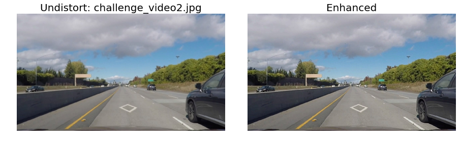

### 3.4. The Frist Yellow and White Color Filter

I used two layers of color filters. This is the first layer, it filters a small part of yellow and white color in HLS space  

**File**: preprocess.py

**Input**: undist_img_enhance

**Output**: wy_img

```
def filter_yellow_white_color(img):
    img_cov = cv2.cvtColor(img, cv2.COLOR_BGR2HLS_FULL)

    if parameters['use_color']:
        y_upper = np.array([80, 255, 255])
        y_lower = np.array([0, 10, 20])
        w_upper = np.array([255, 255, 255])
        w_lower = np.array([0, 195, 0])
    else:
        y_upper = np.array([80, 255, 255])
        y_lower = np.array([0, 10, 20])
        w_upper = np.array([255, 255, 255])
        w_lower = np.array([0, 130, 0])

    y_img_mask = cv2.inRange(img_cov, y_lower, y_upper)
    w_img_mask = cv2.inRange(img_cov, w_lower, w_upper)
    wy_img_mask = cv2.bitwise_or(y_img_mask, w_img_mask)
    # img_new = np.ones_like(img) * 255
    wy_img = cv2.bitwise_and(img, img, mask=wy_img_mask)
    return wy_img
```

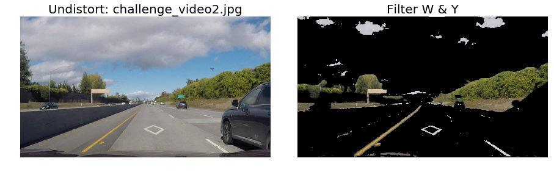

### 3.5-6. The Second Color Filter Base On The First

The second color filter layer is a little trick, I did a lot of trials to find some relationship between brightness and color thresholding. Finally, I get a simple correspondence. I understand this hasn't wide range of applicability, but it works well in this project.

The steps how to get the brightness:

- Convert enhanced image to HLS space.
- Select S channel.
- Select region of interesting
- Sum S channel value of ROI
- Smooth

Then, select channel and adjust the color threshold automatically according to the brightness. 

Yellow has a complex formula.

| Brightness | Select Channel | Yellow Threshold Formula            |
|:----------:|:--------------:|:-----------------------------------:|
|[20, 50]    | S              | [Min((3.0 * brightness), 130), 255] |
|<20         | H              | [0, Max((700.0 / brightness), 10)]  |
|>50         | L              | [Min((60 + brightness), 170), 255]  |

White is easy.

| Brightness | Select Channel | White Threshold Formula             |
|:----------:|:--------------:|:-----------------------------------:|
|All         | B              | [Min((180 + brightness), 230), 255] |


**File**: preprocess.py

**Input**: wy_img

**Output**: (rgb_img, hls_img)->color_img

Flow: test_brightness -> adjust_parameter -> color_select -> combined color

```python
def test_brightness(img):
    hls = cv2.cvtColor(img, cv2.COLOR_BGR2HLS)
    # equ = cv2.equalizeHist(hls[:,:,2])
    roi = region_of_interest(hls[:,:,2])
    nonzero = np.zeros_like(roi)
    nonzero[roi > 0] = 1
    print(roi.shape)
    cnt = np.sum(nonzero)
    brightness = np.sum(roi) / cnt

    return brightness
```


```python
from collections import deque
bright_deque = deque(maxlen=5)
def adjust_parameter(parameters=parameters):
    if parameters['p']:
        return
    brightness = np.mean(bright_deque)
    if brightness >= 20 and brightness <= 50:
        ch = 2 #hls -> s
        s_factor = 3.0
        s_min = brightness * s_factor
        parameters['h'] = parameters_range['hlschannel'][ch]
        parameters['hlsthresh'][ch][0] = int(s_min if s_min < 130 else 130)
    elif brightness < 20:
        ch = 0 #hls -> h
        h_factor = 700
        h_max = h_factor / brightness
        parameters['h'] = parameters_range['hlschannel'][ch]
        parameters['hlsthresh'][ch][1] = int(h_max if h_max > 10 else 10)
    elif brightness > 50:
        ch = 1 #hls->l
        l_factor = 60
        l_min = brightness + l_factor
        parameters['h'] = parameters_range['hlschannel'][ch]
        parameters['hlsthresh'][ch][0] = int(l_min if l_min < 170 else 170)

    b_factor = 180
    b_min = int(brightness + b_factor)
    parameters['rgbthresh'][2][0] = b_min if b_min < 230 else 230
```


```python
def color_select(img, channel='R', parameters=parameters):
    # 1) Convert to HLS color space
    HLS = cv2.cvtColor(img, cv2.COLOR_BGR2HLS)
    if channel == 'R':
        ch_img = img[:,:,2]
        thresh = parameters['rgbthresh'][0]
    elif channel == 'G':
        ch_img = img[:,:,1]
        thresh = parameters['rgbthresh'][1]
    elif channel == 'B':
        ch_img = img[:,:,0]
        thresh = parameters['rgbthresh'][2]
    elif channel == 'H':
        ch_img = HLS[:,:,0]
        thresh = parameters['hlsthresh'][0]
    elif channel == 'L':
        ch_img = HLS[:,:,1]
        thresh = parameters['hlsthresh'][1]
    elif channel == 'S':
        ch_img = HLS[:,:,2]
        thresh = parameters['hlsthresh'][2]
    else:
        ch_img = cv2.cvtColor(img, cv2.COLOR_BGR2GRAY)
        thresh = parameters['graythresh']

    binary_output = np.zeros_like(ch_img)
    binary_output[(ch_img > thresh[0]) & (ch_img <= thresh[1])] = 1
    return binary_output
```


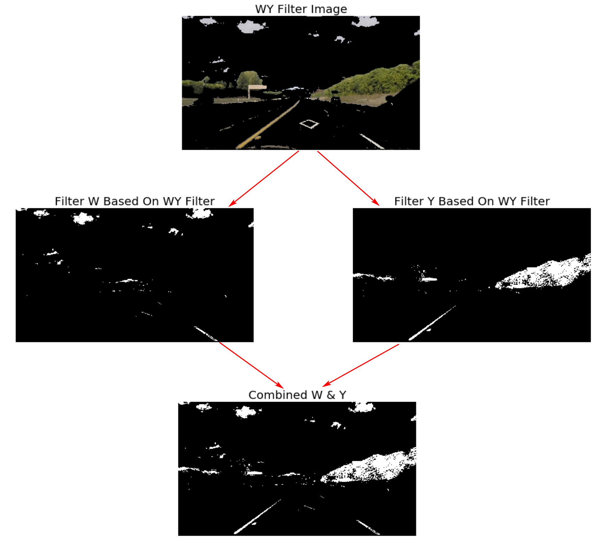

### 3.7. Sobel Filter

I only use x and y sobel filter on harder one. Taking the gradient in the x direction emphasizes edges closer to vertical. Alternatively, taking the gradient in the y direction emphasizes edges closer to horizontal.
I use first color filter output and convert to grayscale, then use GaussianBlur, feed to the Sobel filter at last. 

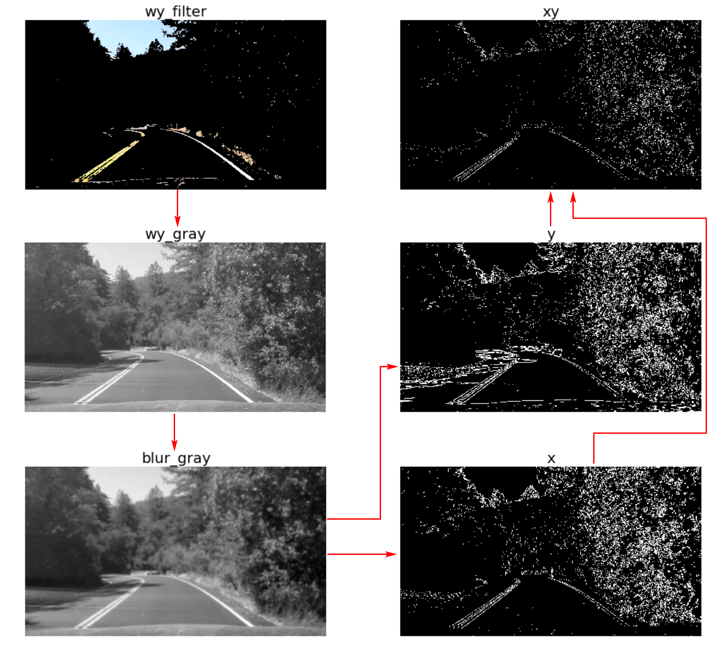

**File**: preprocess.py

**Input**: wy_img->gray image

**Output**: xsobel, ysobel

```python
# Define a function that takes an image, gradient orientation,
# and threshold min / max values.
def abs_sobel_thresh(img, orient='x', sobel_kernel=3,  thresh=(0, 255)):
    gray = img
    # Apply x or y gradient with the OpenCV Sobel() function
    # and take the absolute value
    if orient == 'x':
        abs_sobel = np.absolute(cv2.Sobel(gray, cv2.CV_64F, 1, 0, ksize=sobel_kernel))
    if orient == 'y':
        abs_sobel = np.absolute(cv2.Sobel(gray, cv2.CV_64F, 0, 1, ksize=sobel_kernel))
    # Rescale back to 8 bit integer
    scaled_sobel = np.uint8(255*abs_sobel/np.max(abs_sobel))
    # Create a copy and apply the threshold
    binary_output = np.zeros_like(scaled_sobel)
    # Here I'm using inclusive (>=, <=) thresholds, but exclusive is ok too
    binary_output[(scaled_sobel >= thresh[0]) & (scaled_sobel <= thresh[1])] = 1

    # Return the result
    return binary_output
```

### 3.8. Combination

In this project, I didn't use msobel and dsobel. The output is controlled by parameters. color_img feed to project and challenge. xsobel, ysobel and optional color_img feed to harder challenge. You can see output in section 5-6 and 7 separately.

**File**: preprocess.py

**Input**: xsobel, ysobel, msobel, dsobel, color_img

**Output**: combined image

```python
    if not parameters['use_color']:
        color_img = zero_img
    else:
        color_img = color

    combined = np.zeros_like(gray)
    combined[(((xsobel == 1) & (ysobel == 1)) | ((msobel == 1) & (dsobel == 1))) | (color_img == 1)] = 1
```


### 3.9. Warp Combination Image

Warp perspective transform to a bird view is for easy histogram operations.

**File**: preprocess.py

**Input**: combined image

**Output**: combine_warped image

```python
def warp_perspective(img, M, mtx, dist):
    undist = cal_undistort(img, mtx, dist)
    img_size = (int(img.shape[1]), int(img.shape[0]))
    warped = cv2.warpPerspective(undist, M, img_size)
    return warped
```

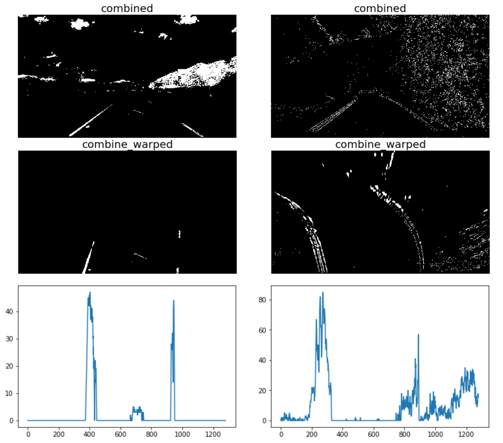 


### 3.10. Lane Lines Finding

#### 3.10.1. Software Architecture
This is the core of the project. This is a rough flow chart, ignoring a lot of detail.

**File**: lane.py 

**Input**: combine_warped image

**Output**: fit_lane_img

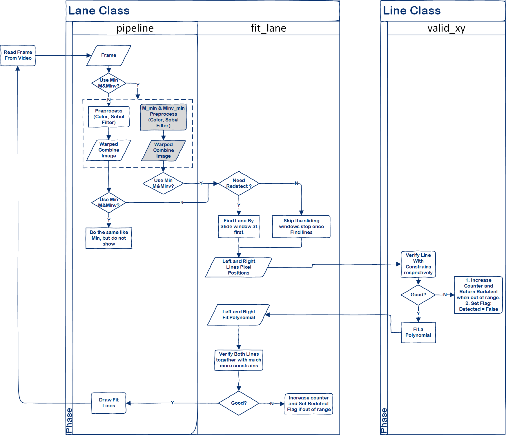 

#### 3.10.2. Radius of curvature

After verifying the current fit. I use these pixels to calculate curvature and then smoothing them.

```python
    def cal_radius_of_curvature(self):
        ym_per_pix = 30 / 720  # meters per pixel in y dimension
        xm_per_pix = 3.7 / 700  # meters per pixel in x dimension
        y_eval = np.max(self.ally)
        try:
            x = self.allx
            y = self.ally
            # Fit new polynomials to x,y in world space
            fit_cr = np.polyfit(y * ym_per_pix, x * xm_per_pix, 2)
            # Calculate the new radii of curvature
            curve = ((1 + (2 * fit_cr[0] * y_eval * ym_per_pix + fit_cr[1]) ** 2) ** 1.5) \
                                       / abs(2 * fit_cr[0])
        except:
            print(self.name, self.cal_radius_of_curvature.__name__)
            return self.radius_of_curvature

        self.curvature_deque.append(curve)
        self.radius_of_curvature = np.mean(self.curvature_deque, dtype=np.float32)
        return self.radius_of_curvature
```

#### 3.10.3. Position of the vehicle

I use best fit to calculate left and right line position, get the bottom x value, minus 640 which is an image center. The output is a positive or negative value. Left line is negative, right line is positive. Add left and right, get the offset. If it's negative, means right, otherwise, left. 
```python
    def cal_line_base_pos(self):
        try:
            xm_per_pix = 3.7 / 700
            y = 720
            fit = self.best_fit
            x_pos = fit[0] * y ** 2 + fit[1] * y + fit[2]
            self.line_base_pos = (x_pos - 640)  * xm_per_pix
            return self.line_base_pos
        except TypeError:
            return None
```


#### 3.10.2. Constraints:
Most of the constraints here are for the harder challenge.

- Line fit thresh. Both logics are used to constraint dramatic change.
	+ thresh_logic: Compare the difference between last fit and current fit. Thresh = fit_thresh * th_scale * factor
		* factor: Adaptive adjustment according to curvature
		* th_scale: Gradual increase and decrease
	+ diffs_logic: Compare last difference and current difference.

```python
def valid_xy(self, x, y, fit_thresh=(1e-2, 3e-1, 1e2)):
	self.th_scale = self.th_pid.update(self.th_scale)
	# print(self.name, "Th Scale: ", self.th_scale)
	try:
	    if len(self.curvature_deque) > 0:
	        curve = abs(np.mean(self.curvature_deque, dtype=np.float32))
	    else:
	        curve = 10000

	    fit_thresh = np.array(fit_thresh)
	    if curve < 50: factor = 5
	    elif curve < 100: factor = 4
	    elif curve < 150: factor = 3
	    ...
	    elif curve < 10000: factor = 1.0
	    else: factor = 0.9
	    fit_thresh = fit_thresh * factor * self.th_scale
	    print("Fit_Thresh: ", fit_thresh, curve, factor)
	except:
	    print('curve miss')

	...

	thresh_logic = abs(fit_diff[0]) > fit_thresh[0] or abs(fit_diff[1]) > 
	               fit_thresh[1] or abs(fit_diff[2]) > fit_thresh[2]
	diffs_logic = (abs(fit_diff[0] - self.last_diffs[0]) > self.th_scale * \
	              max((min((abs(fit_diff[0]), abs(self.last_diffs[0]))), 0.00015)) or \
	              abs(fit_diff[1] - self.last_diffs[1]) > self.th_scale * \
	              max((min((abs(fit_diff[1]), abs(self.last_diffs[1]))), 0.15)) ) or \
	              abs(fit_diff[2] - self.last_diffs[2]) > self.th_scale * \
	              max((min((abs(fit_diff[2]), abs(self.last_diffs[2]))), 100))

    if thresh_logic or diffs_logic:
        self.unvalid_cnt += 1
        self.detected = False
        breakpoint(True)
        self.th_pid.target += 2
        if self.fit_cnt > 0:
            self.fit_cnt -= 1
        return False
    else:
        self.detected = True
        if self.unvalid_cnt > 0:
            self.unvalid_cnt -= 1
        self.fit_cnt += 1
        if self.th_pid.target > 1.9:
            self.th_pid.target = max((np.floor(self.th_pid.target - 1), 0.5))
        return True

```

- Both Lines Constraints. According to the current line fit, decided to how to choose output fit. All constraints are shown in the figure.
	+ Current fit: are left_line.current_fit and right_line.current_fit which detected this frame.
	+ Last used fit: are self.left_fit and self.right_fit which used to show last frame fit lane.

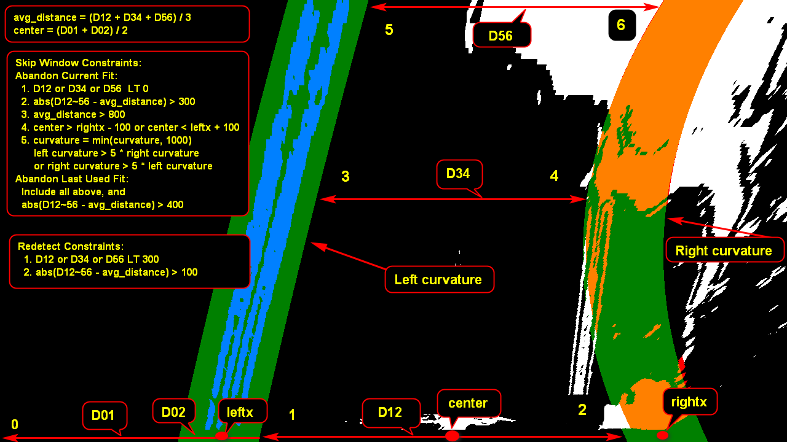 

After getting the abandon outcome. The system decides which fit will be used.

```python
        if abandon_last_used_fit:
            print("FIT: 1 fit")
            left_fit = left_line.best_fit
            right_fit = right_line.best_fit
            self.redetect_cnt += 1
            self.fit_well = 0
            self.distance_queue.append(lane_distance)
        elif abandon_line_current_fit:
            print("FIT: 2 fit")
            if True or left_line.detected:
                left_fit = self.left_fit
                left_line.last_fit = self.left_fit
            else:
                left_fit = self.left_fit
                left_line.last_fit = left_line.best_fit

            if True or right_line.detected:
                right_fit = self.right_fit
                right_line.last_fit = self.left_fit
            else:
                right_fit = self.right_fit
                right_line.last_fit = right_line.best_fit
            self.redetect_cnt += 1
            self.fit_well = 0
            self.distance_queue.append(lane_distance)
        else:
            print("FIT: 3 fit")
            if left_line.detected and right_line.detected:
                if left_line.fit_cnt > 0:
                    left_fit = left_line.current_fit
                    left_line.store_current_fit()
                else:
                    left_fit = self.left_fit
                left_line.last_fit = left_line.current_fit

                if right_line.fit_cnt > 0:
                    right_fit = right_line.current_fit
                    right_line.store_current_fit()
                else:
                    right_fit = self.right_fit
                right_line.last_fit = right_line.current_fit

            else:
                left_line.last_fit = self.left_fit
                left_fit = self.left_fit
                right_line.last_fit = self.right_fit
                right_fit = self.right_fit
```


### 3.11. Project Back

**File**: lane.py

**Input**: undist_img and fit_lane_img polynomial curve

**Output**: project image

In the project output, I list most of parameters.

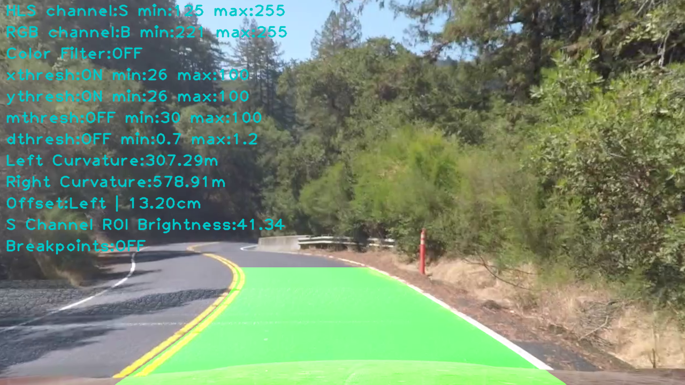 

### 3.12. Warp Projected

**File**: lane.py

**Input**: project image

**Output**: warp_project image

I also list the warp projected image for debugging.
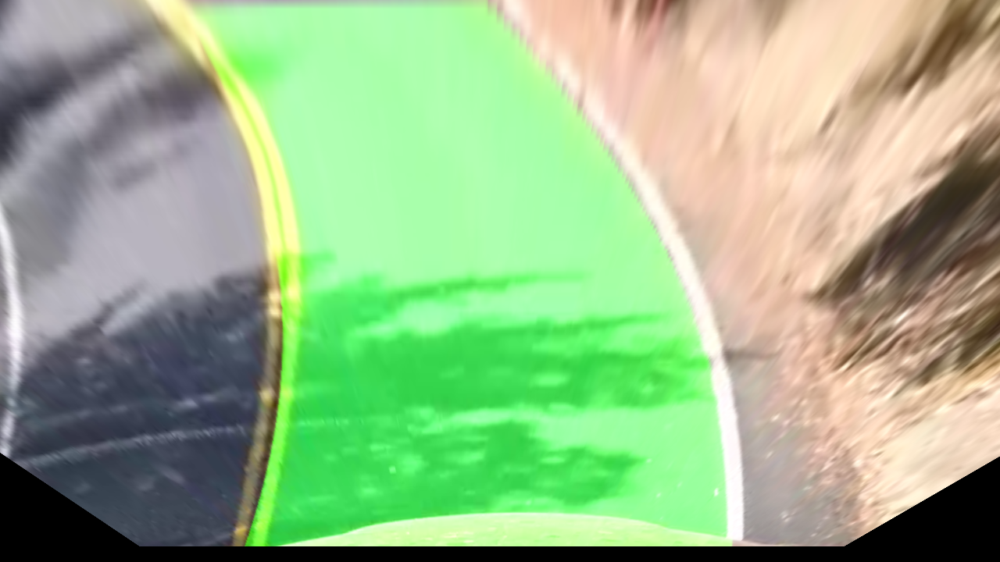 


## 4. Parameters

I use a parameters dictionary for configuring kinds of parameters and storing. I create a parameters_range to limit the scope of the partial value. When everything is OK, I store them to the "data.pickle" file. Then do not need to re-adjust the parameters each time.

**File**: preprocess.py

```python
parameters = {
    'hlsthresh': [[0, 40], [145, 255], [80, 255], [0, 255]],
    'rgbthresh': [[200, 255], [200, 255], [200, 255], [0, 255]],
    'graythresh': [0, 255],
    'xthresh': [26, 100],
    'ythresh': [26, 100],
    'mthresh': [30, 100],
    'dthresh': [0.7, 1.2],
    'xksize': 3,
    'yksize': 3,
    'mksize': 9,
    'dksize': 15,
    'h': 'S',
    'c': 'B',
    'b': False,
    'x': True,
    'y': True,
    'm': True,
    'd': True,
    'u': True,
    'w': True,
    'p': True,
    's': False,
    'r': True,
    'mtx': None,
    'dist': None,
    'M_max': None,
    'MInv_max': None,
    'M_mid': None,
    'MInv_mid': None,
    'M_min': None,
    'MInv_min': None,
    'M': None,
    'MInv': None,
    'left_curverad': 0,
    'right_curverad': 0,
    'config-option': 0,
    'brightness': 0,
    'use_color': False,
    'color_sw': True,
    'margin': 40,
    'offset': 0
}

parameters_range = {
    'hlsthresh': (0, 255, 2),
    'rgbthresh': (0, 255, 2),
    'xthresh': (0, 255, 2),
    'ythresh': (0, 255, 2),
    'mthresh': (0, 255, 2),
    'dthresh': (0, np.pi/2, 0.2),
    'hlschannel': ('H', 'L', 'S', 'Gray'),
    'rgbchannel': ('R', 'G', 'B', 'Gray'),
}
```

## 5. Key Handler

To facilitate the adjustment of parameters, I define a lot of shortcuts, the following table is their description.

**File**: preprocess.py

**Function**: key_handler

| key  | parameters key | transition      | description                                     | 
|:----:|:--------------:|:-------------------:|:--------------------------------------------|
| h    | 'h'            | '9', '0', '-', '=' | Shift HLS channel, also enable transition key|
| c    | 'c'            | '9', '0', '-', '=' | Shift RGB channel, also enable transition key|
| b    | 'b'            | None               | Toggle breakpoint function， <br>put breakpoint(bool) anywhere want to stop|
| x    | 'x'            | '9', '0', '-', '=' | Toggle xsoble, also enable transition key    |
| y    | 'y'            | '9', '0', '-', '=' | Toggle xsoble, also enable transition key    |
| m    | 'm'            | '9', '0', '-', '=' | Toggle msoble, also enable transition key    |
| d    | 'd'            | '9', '0', '-', '=' | Toggle dsoble, also enable transition key    |
| p    | 'p'            | None               | Pause, still processing current frame, <br>you can adjust threshold and shift channel|
| s    | 's'            | None               | Debug Step mode, processing frame one by one |
| r    | 'r'            | None               | Debug Run mode, cancel step mode, processing frame continuously|
| C    | 'color_sw'     | None               | Color filter switch                          |
| S    | None           | None               | Store Parameters                             |
| 9    | None           | None               | Decrease threshold min value                 |
| 0    | None           | None               | Increase threshold min value                 |
| -    | None           | None               | Decrease threshold max value                 |
| =    | None           | None               | Increase threshold max value                 |
| u    | 'u'            | None               | Toggle undistortion                          |
| q    | None           | None               | Quit GUI                                     |

Besides, there is a trackbar for selecting and displaying frame.

## 6. Video Ouput

I combined all three debug and project videos together.

All [Debug Videos](https://youtu.be/dtjdQLUjK1M)
All [Project Videos](https://youtu.be/MHfkb9zAEaI)

---

## 7. Discussion

The image output of the first two projects is relatively stable, and the lane is straight, so I chose the color to do the lane finding. Then, I spent most of time on the third project, and I think the main reason that the output seems to work most of the time is because I chose a small matrix, with adaptive threshold tuning. But there are still many problems that have not been solved, especially in particularly bright areas and sharp turns. I've tried many methods, including creating fake lanes, but when they are generated is not particularly well-defined. In addition, I think I should add more cybernetic techniques, such as PID, but I still lack of knowledge of these contents.